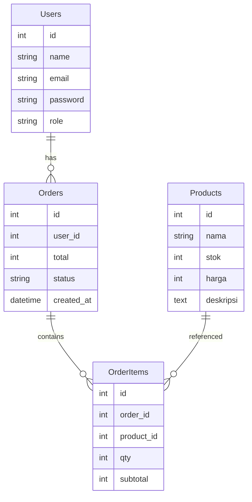

## 📝 ERD Database




```markdown
## 📄 LRS Logical Record Structure

### Tabel Users
| Field | Type | Description |
|-------|------|------------|
| id | INT PK | Id user |
| name | VARCHAR | Nama user |
| email | VARCHAR UNIQUE | Email untuk login |
| password | VARCHAR | Password terenkripsi |
| role | ENUM(admin, user) | Hak akses |

### Tabel Products
| Field | Type | Description |
|-------|------|------------|
| id | INT PK | |
| nama | VARCHAR | |
| stok | INT | |
| harga | INT | |
| deskripsi | TEXT | |

### Tabel Orders
| Field | Type | Description |
|-------|------|------------|
| id | INT PK | |
| user_id | INT FK users.id | Relasi ke user pemesan |
| total | INT | Total harga pesanan |
| status | ENUM(pending, diproses, selesai, dibatalkan) | Status pesanan |
| created_at | TIMESTAMP | Tanggal dibuat |

### Tabel OrderItems
| Field | Type | Description |
|-------|------|------------|
| id | INT PK | |
| order_id | INT FK orders.id | Relasi ke pesanan |
| product_id | INT FK products.id | Relasi ke produk |
| qty | INT | Jumlah |
| subtotal | INT | Total per item |
```